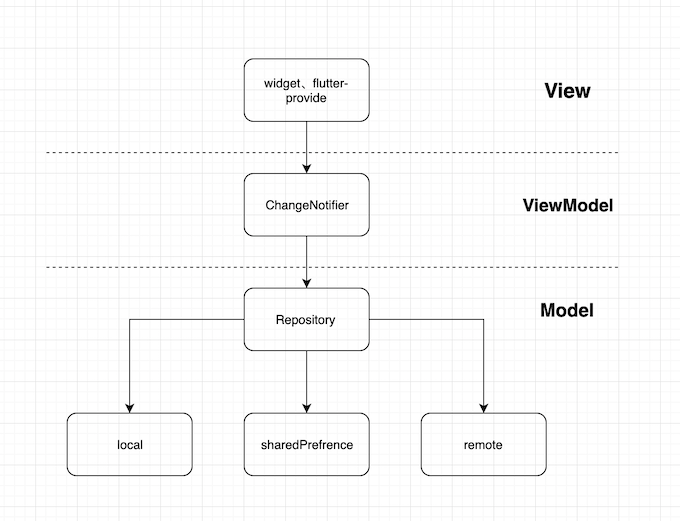

# MVVM-Flutter

Build MVVM App for Android and IOS with Flutter。

The Structure seems like [MVVM-Android](https://github.com/ditclear/MVVM-Android)。



##### DownLoad


#### dependencies

- [dio](https://github.com/flutterchina/dio) : netword 
- [rxdart](https://github.com/ReactiveX/rxdart)：reactive programming
- [provider](https://github.com/rrousselGit/provider)：state managing
- [dartin](https://github.com/ditclear/dartin): dependency injection

> PS：each layer connected by rx, use responsive thinking and rxdart operators for logical processing.Finally, update the view with [provider](https://github.com/rrousselGit/provider).

### ScreenShot


#### Code

```dart
//remote
class GithubService{
  Observable<dynamic> login()=> get("user");
}
//repo
class GithubRepo {
  final GithubService _remote;

  GithubRepo(this._remote);

  Observable login(String username, String password) {
    token = "basic " + base64Encode(utf8.encode('$username:$password'));
    return _remote.login();
  }
}
//viewmodel
class HomeViewModel extends ChangeNotifier {
  final GithubRepo _repo; 
  String username = ""; 
  String password = ""; 
  bool _loading = false; 
  String _response = ""; 
  //...
  HomeViewModel(this._repo);

   /**
   * call the model layer 's method to login
   * doOnData : handle response when success
   * doOnError : handle error when failure
   * doOnListen ： show loading when listen start
   * doOnDone ： hide loading when complete
   */
  Observable login() => _repo
      .login(username, password)
      .doOnData((r) => response = r.toString())
      .doOnError((e, stacktrace) {
        if (e is DioError) {
          response = e.response.data.toString();
        }
      })
      .doOnListen(() => loading = true)
      .doOnDone(() => loading = false);
}

/// View ：HomePage
///
/// 获取其它页面传递来的参数
class HomePage extends PageProvideNode<HomeProvide> {
  /// 提供
  ///
  /// 获取参数 [title] 并生成一个[HomeProvide]对象
  HomePage(String title) : super(params: [title]);

  @override
  Widget buildContent(BuildContext context) {
    return _HomeContentPage(mProvider);
  }
}
// ...
class _HomeContentPageState extends State<_HomeContentPage> implements Presenter{
   //...
  _HomeState(this._viewModel) {
    providers.provideValue(_viewModel);
  }
	
  @override
  Widget build(BuildContext context) {
    return Scaffold(
        appbar://...,
        body://...
       
        CupertinoButton(
            onPressed: ()=>onClick(ACTION_LOGIN),
            //...
         ),
         Container(
                //...
                child: Provide<HomeViewModel>(
                  builder: (BuildContext context, Widget child,
                          HomeViewModel value) =>
                      Text(value.response),
                ),
              ),
        //...
        
        );
  }
  
  /// 通过[action]进行事件处理
  @override
  void onClick(String action) {
    print("onClick:" + action);
    if (ACTION_LOGIN == action) {
      _login();
    }
  }
  
    
  _login()=>_viewModel.login().doOnListen(() {
      _controller.forward();
    }).doOnDone(() {
      _controller.reverse();
    }).listen((_) {
      //success
      Toast.show("login success",context,type: Toast.SUCCESS);
    }, onError: (e) {
      //error
      dispatchFailure(context, e);
    });
 
}

```

#### LICENSE

the Apache License

